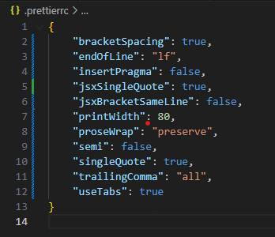

# 1.2- Formatação do código
 

***

### 1.2.1- Evitar comentários
Os nomes dos componentes, funções, objetos, variáveis e argumentos devem ser autoexplicativos o suficiente, de modo a tornar os comentários desnecessários. 

Se os nomes forem autoexplicativos e o código estiver limpo e legível, a maioria dos comentários se tornarão dispensáveis e redudantes, e sua presença, além de dificultar a leitura do código, poderá levar a erros, ao ocorrerem modificações no código, sem a correspondente atualização do comentário original. 

Entretanto, os seguintes tipos de comentário são úteis e, às vezes, necessários: 
- Avisos de natureza jurídica 
- Premissas ou pré-condições para executar uma função 
- Explicações sobre algo implícito: por exemplo Regex 
- TO DOs (Modificações futuras no código) 

Exemplos de comentários úteis:

    function processPayment(cardNumber, expDate, cvv, amount) { 
        /*
            This function processes credit card payments
            Legal: This code must comply with PCI DSS standards.
            Preconditions: The transaction amount must be > $0.
            Limitations: This function only supports Visa and Mastercard payments. 
        */

        // Function code goes here ...    
    }

    // accepts [text]@[text].[text], i.e. it simply requires an "@" and a dot
    const emailRegex = /\S+@\S+\.\S+/;

  

***

### 1.2.2- Formatação horizontal
- Máximo de 80 caracteres por linha 
- Usar identação para expressar o escopo 
- Não usar ponto e vírgula ao final das declarações, a menos que necessário... 
- Usar aspas simples nas literais de strings e nomes de propriedades 
- Para garantir as regras acima, crie ou substitua o arquivo de nome '.prettierrc', na pasta raiz do projeto, com o seguinte objeto: 

 

Isto fará com que o plugin prettier salve o arquivo fonte com as regras de formatação horizontal, definidas acima.
 
 

***

### 1.2.3- Formatação vertical
- As funções chamadoras devem estar acima das funções chamadas, sempre que possível. 
- Mantenha conceitos relacionados próximos, ou seja, idealmente, mantenha as funções chamadas imediatamente abaixo de suas funções chamadoras. 
- Use linhas em branco para separar conceitos não relacionados diretamente. 
- Nos componentes React, os grupos de elementos devem vir na ordem abaixo: 
>- states 
>- funções que tratam eventos da renderização ou são passadas para sub-componentes 
>- useEffects (Se houver uma sequência de atualização, dispô-los na ordem em que são chamados pela atualização dos states), e suas funções associadas 
>- funções que cooperam com a renderização, cujo nome deveria começar com *render*. 
(Idealmente, cada uma destas funções deveria ser transformada em um componente React separado, mas em casos de funções bem pequenas, talvez seja mais legível deixá-las, aqui, no componente cliente )
>- return de renderização do componente 
 
