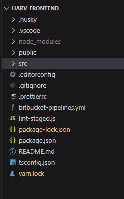
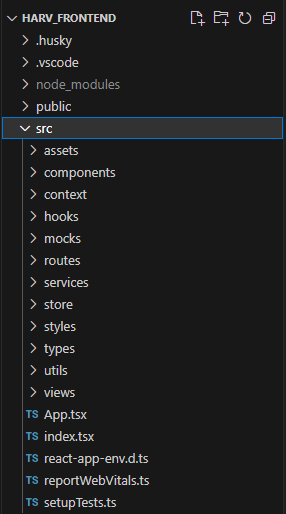

# 2.2- Estrutura de Pastas do Projeto

Todos os projetos devem procurar seguir a estrutura de folders descrita a seguir.

Na pasta principal do projeto, cujo nome é o nome do projeto, ou uma abreviação deste nome, tem-se o seguinte conteúdo:

 

| Pasta/Arquivo            | Conteúdo                                                           |
| :----------------------: | :----------------------------------------------------------------- |
| .husky                   |  |
| .vscode                  |  |
| node_modules             | Pasta gerenciada automaticamente pelo pacote **npm**.    Não deve ser alterada, manualmente. |
| public                   | Pasta onde ficam os arquivos estáticos básicos necessários para exibição   do aplicativo no navegador cliente, incluindo o arquivo **index.html**.   Os demais arquivos estáticos são mantidos na pasta **/src/assets**. |
| src                      | Pasta onde fica o código do aplicativo, descrita na seção abaixo. |
| .editorconfig            |  |
| .gitignore               | Arquivo para configuração dos arquivos e pastas, que não devem   ser armazenados remotamente pelo gerenciador de versões **Git**. |
| .prettier                | Arquivo de configurações do plugin **prettier**.   |
| .bitbucket-pipelines.yml | Configurações para execução dos pipelines de deploy no ambiente de **dev**.   Mantido pela equipe **DevOps**. |
| lint-staged.js           |
| package.json             | Arquivo que controla quais bibliotecas devem ser instaladas pelo   comando **npm install** |
| package-lock.json        | Arquivo utilizado pelo **npm**, em conjunto com o arquivo **package.json**,   cuja função é impedir que o **npm** instale versões posteriores às que   constam nele, visando assim reduzir problemas de compatibilidade entre   as versões das bibliotecas e o próprio **node.js**. |
| tsconfig.json            | Arquivo de configurações do **TypeScript**, no projeto. |
| yarn.lock                | Similar ao arquivo package-lock.json, se estiver sendo usado o pacote **yarn**,   em lugar do **npm**. |

 

***

## Conteúdo da pasta **/src**

Na pasta '/src' deve-se procurar seguir os nomes de arquivos e sub-folders vistos na figura abaixo

| Pasta/Arquivo  | Conteúdo                                                           |
| :------------: | :----------------------------------------------------------------- |
| assets         | Todos os ícones, imagens, áudios, etc. estáticos a serem exibidos nas diversas   telas e componentes do sistema. |
| components     | Todos os componentes do aplicativo, incluindo modais,   que não são telas do sistema. |
| context        | Todos os componentes que provêm contexto no aplicativo. |
| hooks          | Todos os componentes do tipo *Hook*. |
| mocks          | Todos os componentes ou estruturas com dados mocados. |
| routes         | O componente **Router** e todo o código que implementa o roteamento e   navegação entre páginas, no aplicativo. |
| services       | Arquivos que implementam serviços de acesso a APIs, backend, bancos de dados,   serviços de storage, etc., cujas funções, são, normalmente, chamadas pelas funções   (métodos) dos componentes declarados na pasta **components** ou na pasta **views**. |
| store          | Código que implementa o gerenciamento de state usando **react-redux**. |
| styles         | Código que define os temas e estilos padrão do aplicativo. |
| types          | Declarações das interfaces e tipos typescript usadas no aplicativo. |
| utils          | Funções genéricas e auxiliares para a implementação do aplicativo. |
| views          | Todos os componentes que são telas do aplicativo. |
| App.tsx        | Este arquivo declara o componente raiz do aplicativo, sempre chamado de **App**,   o qual inicia a renderização do componente **Routes**, que por sua vez, controla   a renderização das demais telas do sistema.   A seção [2.3- Programa - Roteamento de páginas]() apresenta mais detalhes sobre   o funcionamento destes componentes. |
| index.tsx      | Este arquivo é gerado automaticamente pelo script *create-react-app*, é padrão em   todos os frontends e, basicamente, é usado para vincular o componente React raiz,   do aplicativo, ao elemento HTML que apresenta o conteúdo da página de entrada   do aplicativo.          Como padrão, sempre chamamos o componente React raiz de 'App' e o elemento   HTML, que apresenta o conteúdo da página index.html, de 'root', como se observa   na figura acima. Além disso, o arquivo 'index.html', é sempre criado na pasta '/public'   pelo script *create-react-app*.

***
