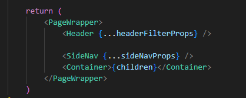
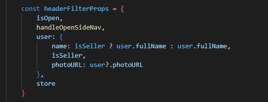
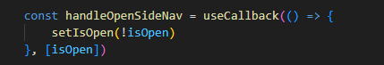
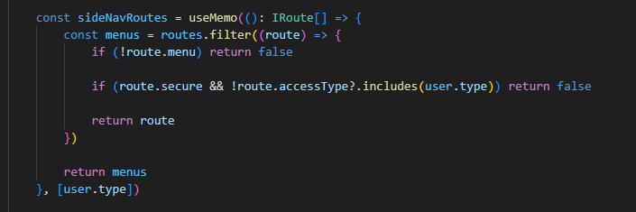

# 2.4- Header e Menu de navegação do Aplicativo

Além do controle de navegação, visto na seção [Roteamento de páginas](03-page-routing.md), existe um componente padrão, chamado **Layout**, que produz a exibição de um Header, na parte superior da tela, e de um Menu de Navegação lateral, no lado esquerdo da tela, o qual também participa do controle de navegação de páginas padrão, do aplicativo. 

Este componente é definido pelo código mantido na pasta **/src/components/layout**.

O componente principal é, como vimos, o componente **Layout**, definido no arquivo **/src/components/Layout/index.tsx**.

Essencialmente, este componente, renderiza os componentes vistos na figura abaixo.

 

- **Header**, definido na pasta **/src/components/Layout/components/Header**, cuja função é exibir na parte superior da tela o ícone do aplicativo e informações do usuário logado, avatar, nome e outras, que estejam salvas no store redux do aplicativo.

- **SideNav**, definido na pasta **/src/components/Layout/components/SideNav**, cuja função é exibir na lateral esquerda da tela um menu que dá acesso a um grupo específico de telas do aplicativo. 

- **Container**, como o nome indica, o componente **Container** é apenas um recipiente do tipo **styled component** para envolver o componente React que houver sido definido para a tela corrente, passado para o componente **Layout** no parâmetro **children**.

 

A propriedade **headerFilterProps**, passada para o componente **Header** é definida com o seguinte objeto

Este objeto, configura: 

- Se o menu lateral está visível, ou não, através da propriedade **isOpen**. 
- Como e quando o menu lateral será exibido ou escondido, em função do comportamento da função **handleOpenSideNav**, que no caso padrão, é definida assim: 

 

- Os dados padrão do usuário, o nome e seu avatar, através da propriedade **user**.
- Dados adicionais salvos no store redux, através da propriedade **store**.

 

Por fim, a propriedade **sideNavProps**, passada para o componente **SideNav**, determina quais páginas do aplicativo (definidas no arquivo **/src/routes/routes.ts**) serão exibidas como links no menu lateral, em função da propriedade **menu** ser **true** ou **false**, e faz também o controle de acesso do usuário logado a estas telas, em função dos perfis listados no usuário corrente e dos perfis listados na propriedade **route.userType** da respectiva página. Vide código abaixo. 

 
 

***
