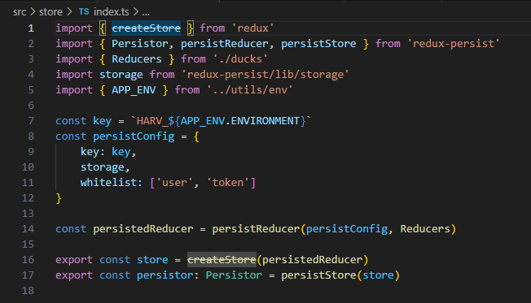
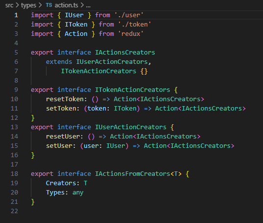

# 2.8- Gerenciamento de State

 

## O que é Gerenciamento de *state* ?

O *State* é um conjunto de informações que são importantes para todo o aplicativo, no frontend (*Client*), e que precisam ser preservadas na memória desse cliente. Tipicamente, o *state* é constituído por informações do usuário logado, tais como, nome, e-mail, avatar, token, etc., mas pode incluir outros tipos de informação. 

O *Gerenciamento de state* é simplesmente a forma como as informações do state são obtidas, salvas em um repositório na memória e recuperadas desse repositório, para uso pelos diversos componentes React do aplicativo.

Com o objetivo de evitar que cada aplicativo criado efetue esse gerenciamento de uma forma diferente e, também, para garantir que se usem as melhores e mais eficientes práticas, nos aplicativos da **BuildBox** usamos as bibliotecas [**react-redux**](https://react-redux.js.org/) e [**redux-persist**](https://github.com/rt2zz/redux-persist#readme), para realizar o gerenciamento de *state* nos *Clients*, tanto *web* quanto *mobile*.

A biblioteca **react-redux** é, basicamente, um recipiente (*store*) para manter todo o *state* do aplicativo em um repositório único, e que, ao mesmo tempo, define métodos padrão estritos para salvar e disponibilizar as informações no e do store, a partir dos componentes React do aplicativo. 

A biblioteca **redux-persist** permite que o *store* do **react-redux** seja persistido por um *storage engine*, como por exemplo, o *LocalStorage* do navegador ou o *AsyncStorage* no **React-Native**, o que possibilita a persistência do store, mesmo após atualizações (*refreshes*) do navegador, reinicialização do navegador, ou até do dispositivo. 
 
 

## Funcionamento do React-Redux

O **react-redux** possui 4 componentes principais:

- Um *store* onde serão armazenadas as informações do aplicativo, que nos interessa armazenar. 
- Um componente React, chamado **Provider** que é responsável por disponibilizar o *store* **redux** a todos os componentes da árvore de componentes React.. Ele envolve toda a árvore de renderização do React, permitindo que todos os componentes envolvidos tenham acesso ao *store* 
- Ações para salvar partes específicas do *state* do aplicativo no *store*. 
- Ações para ler partes específicas do *state* armazenado no *store*. 
 

Vamos explicar como isso deve ser feito na forma padronizada definida para o código da **BuildBox**.

 

### Passo 1: Copiar o código do *store* do Harv
O código é 90% similar em todos os aplicativos e, assim, sugere-se partir do conteúdo da pasta **/src/store** do projeto **Harv** e fazer as alterações indicadas nos passos seguintes.
 
 

### Passo 2: Alterar o arquivo **/src/store/index.ts**

Neste arquivo, criamos o *store* redux e o *store* persistente, e os exportamos para uso pelo componente **App**, explicado na seção [2.3- Roteamento de páginas do Aplicativo](03-page-routing.md).

Na imagem abaixo, vemos o código de renderização do componente **App**, onde os objetos **store** e **Persistor**, importados do arquivo **/src/store/index.ts**, são disponibilizados para todos os componentes *React* da árvore de renderização do aplicativo.

 

O arquivo **/src/store/index.ts** é igual em todos os aplicativos, exceto pelo conteúdo atribuído à propriedade **whitelist** do objeto **persistConfig**, linha 11 no código acima.

No caso do projeto **Harv**, usado aqui como modelo, as informações salvas são organizadas em dois objetos, um chamado **'user'** e outro chamado de **'token'**. Esses nomes podem variar de aplicativo para aplicativo e, portanto, devem ser alterados conforme o caso. Estas são as únicas alterações a serem feitas neste arquivo. 
 
 

### Passo 3: Alterar o arquivo **/src/store/ducks/index.ts**

No caso do projeto modelo, usado aqui, estamos organizamos as informações a serem salvas no *store* em dois objetos, que chamamos de **user** e **token**, e, desse modo, as linhas 5,6,9 e 10 do código acima, refletem essas definições. Caso o seu aplicativo, tenha outros nomes escolhidos, faça as alterações necessárias nestas linhas e, basicamente, isso é tudo o que precisa ser mudado neste arquivo. 
 
 

### Passo 4: Alterar o(s) arquivo(s) onde são definidas as ações **redux**

O conteúdo da pasta **/src/store**, no caso do nosso projeto modelo, **Harv**, é este 

No caso de um projeto novo, a pasta **/src/ducks** e os arquivos de nome **index.ts** não sofrem alterações de nome, apenas de conteúdo, como vimos acima. 

Os arquivos **/src/store/ducks/token.ts** e **/src/store/ducks/user.ts** devem ser ajustados, no nome e conteúdo, em conformidade com os tipos de objetos e informações que queremos salvar no **store** no novo aplicativo. 

Vamos analisar o arquivo **/src/store/ducks/user.ts** para deixar claro seu conteúdo e o que precisa ser mudado, ou não, em novos casos. 

 

#### Em primeiro lugar 

As linhas de 11 a 15, do código acima, definem as ações (*Actions*) do **store** que poderão ser chamadas pelos componentes React do aplicativo para salvar informações do Usuário no **store**. Neste caso, **setUser(...)** para salvar as informações de um objeto User no **store** e **resetUser** para atribuir valores vazios ou *default* ao **store** do Usuário. 
 

#### Em segundo lugar 

As linhas de 20 a 37 definem as informações a serem armazenadas no **store** do Usuário, linhas 20 a 35, e as funções que devem ser usadas, no caso **set** e **reset** para executar as *Actions* definidas anteriormente.
 
 

#### Em terceiro lugar 

As linhas de 42 a 48 criam o *Reducer* do objeto **user** que será utilizado pelo arquivo **/src/store/ducks/index.ts**, visto anteriormente e reproduzido abaixo, novamente.

Observe que, na linha 6, quando declaramos

    import user from './user'

estamos, de fato, importando o retorno da função **createReducer(...)**, executada na linha 42 do arquivo anterior, uma vez que esta é declarada como **export default**.
 
 

#### Alterações a serem feitas no arquivo 

Considerando o apresentado anteriormente, as alterações a serem feitas neste arquivo são: 

- Alterar os nomes das ações e do objeto, **'user'**, para os nomes apropriados. 
- Alterar as interfaces utilizadas, na linha 11, e as interfaces correspondentes no arquivo **/src/types/action.ts**, o qual não havia sido citado ainda neste texto, e é apresentado abaixo.

 

- Alterar o objeto a ser salvo no *store*, nas linhas 20 a 35, e os nomes das funções handlers, conforme o caso. 
- Alterar os nomes e interfaces utilizados em **createReducer(...), conforme os novos nomes e interfaces em uso.
 
 

 
 

***
