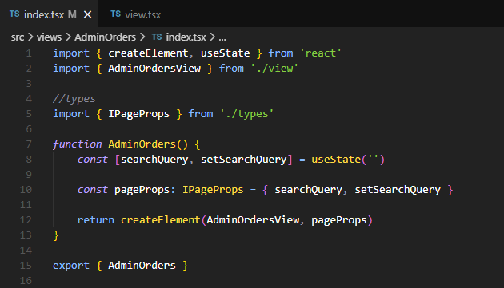
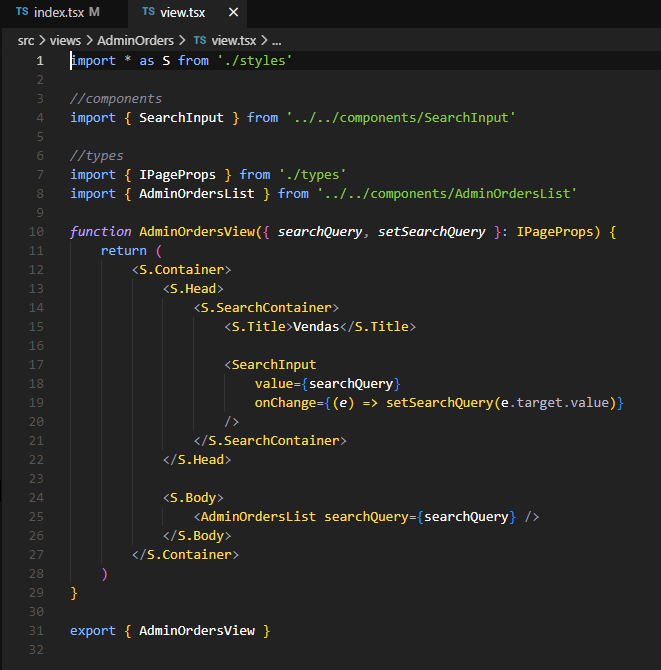
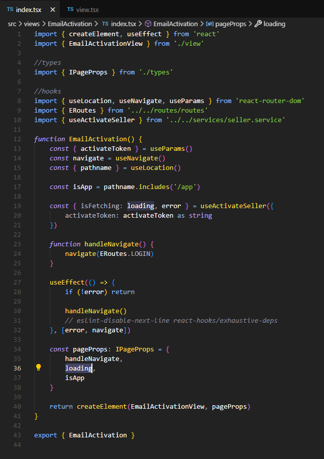
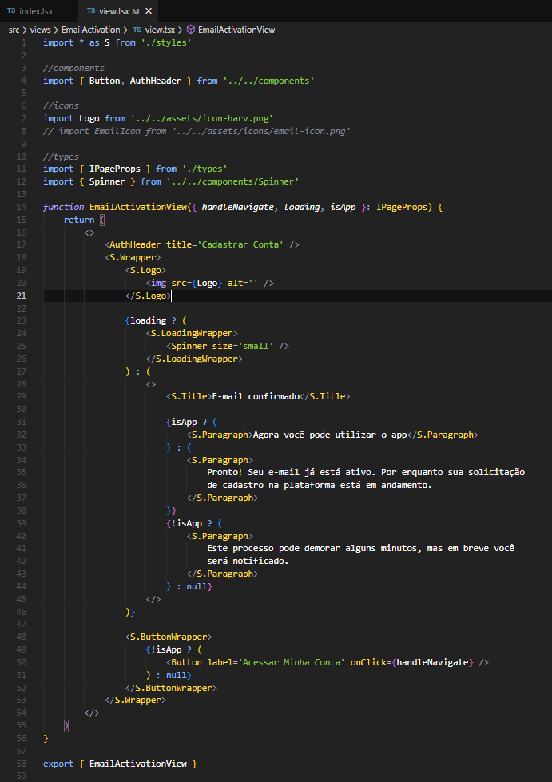

# 2.12- Controller/View

 

O padrão (ou *design pattern*) *Controller/View* é uma forma de reorganizar um componente **React** em dois componentes, uma parte que chamamos de *Controller* e uma parte que chamamos de *View*, com as responsabilidades descritas abaixo.

**View**
- Faz toda a renderização (JSX) do componente.
- Não possui nenhum state e todas as informações a dinâmicas a serem renderizadas são recebidas como props.

**Controller**
- Na reorganização do componente original, a parte *Controller* fica com todos os *states* do componente original e se torna o único responsável pela aquisição e manutenção das informações desses states, portanto, todos os acessos a APIs externas e bancos de dados são feitos neste componente e, também, os *hooks* do tipo **useEffect()**, responsáveis pelas atualizações de state em sequência, são todos executados neste componente.
- Não possui nenhuma rederização, exceto a chamada do respectivo componente *View*, no **return** final do componente *Controller*, como no código abaixo:
 

Neste exemplo, nosso componente *Controller* é o componente **AdminOrders** e o componente *View* é chamado de **AdminOrdersView**.

Veja o código do componente *View* abaixo.
 

Observe como todo o *state* fica no *Controller*, neste caso **searchQuery**, e como toda a lógica de renderização é mantida no componente *View*

Na **Build** adotamos sempre como padrão declarar o *Controller* e a *View* em arquivos seprados, sendo o nome do arquivo do *Controller* sempre chamado de **index.tsx** e o nome do arquivo que contem o componente *View* sempre chamado de **view.tsx**.

Outra regra que usamos é que este padrão é usado apenas para componentes mais complexos, com mais código e lógica, sendo normalmente usado nos componentes que representam telas, localizados na pasta **/src/views** e não sendo usado nos componentes salvos na pasta **src/components**, pelo fato destes serem componentes reusáveis, tipicamente, mais simples.

Outro exemplo, um pouquinho mais complexo, é mostrado a seguir, o componente **EmailActivation**. Primeiro, mostramos a parte *Controller*, abaixo.

e depois a parte *View*, a seguir

Note como todos os *state*, neste caso declarados em *Hooks* e como toda a lógica de busca e manutenção desses states estão no *Controller* e como toda a lógica de renderização foi colocada na *View*.

 
 

***
