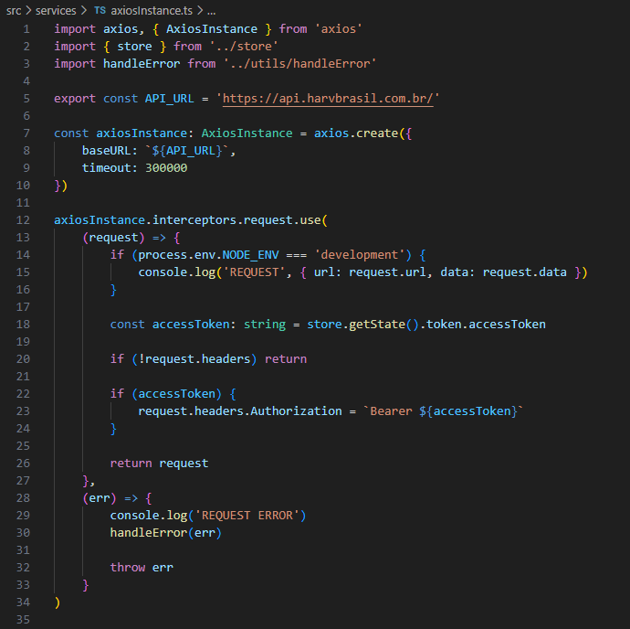
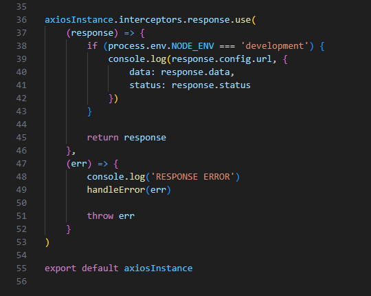

# 2.6- Acesso a APIs externas
 

O acesso a APIs externas é feito atraves da biblioteca [**axios**](https://axios-http.com/docs/intro), utilizando o objeto **AxiosInstance**, conforme o padrão mostrado no arquivo **/src/services/axiosInstance.ts**, exibido abaixo. 

Basicamente, este arquivo cria um objeto **axiosInstance**, configurando o domínio e *timeout* para todas as requests. 

Depois, é criada uma função anônima para interceptar cada request

    (request) => {...}

O papel desta função é injetar em cada request as informações de autenticação no campo **Authorization** do **Header**, da respectiva request.

Existe também uma função anônima que direciona os erros de comunicação para serem tratados pela função **handleError(err)**, definida no arquivo **/src/utils/handleError.ts**, a qual será explicada na seção [2.7- Tratamento de Erros](7-error-management). 
 

Além disso, este arquivo define, também, duas outras funções anônimas, que são executados na chegada de uma resposta da API, mostradas abaixo. 

 

A função que intercepta a resposta é usada para fins de depuração, quando o sistema está em ambiente de desenvolvimento. 

A função de tratamento de erros trabalha de forma similar à situação de envio de request, mostrada acima. 
 
 

***
