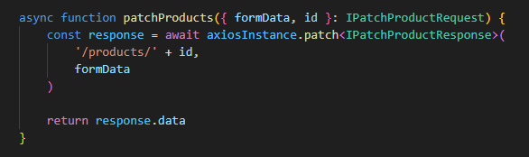
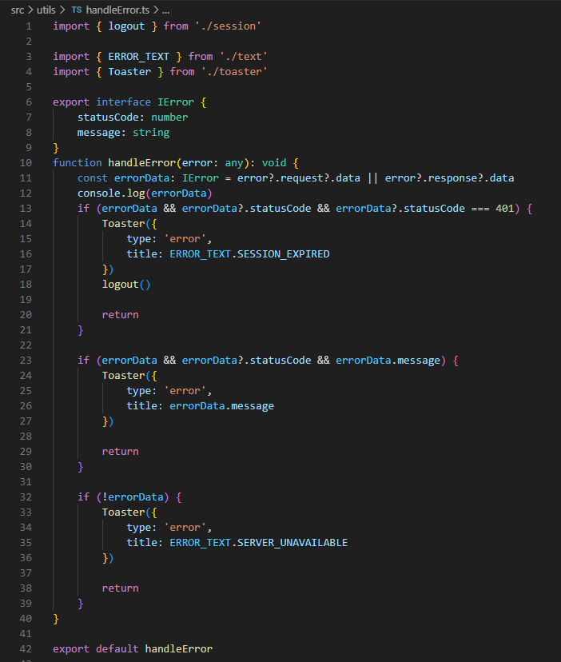
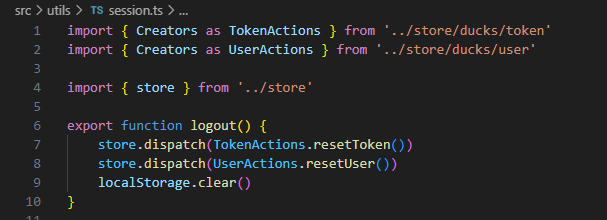

# 2.7- Tratamento de Erros

 

O escopo desta seção, atualmente, resume-se a erros ocorridos no acesso a APIs externas. 

O objetivo por detrás deste design é concentrar o código de tratamento de erros em um único local, de modo a reduzir inconsistências em manutenções futuras e de modo a deixar todo o código do aplicativo mais leve, por estar 'limpo' de código que trata erros.

O que foi feito foi, incluir 2 funções anônimas para tratamento de erros nos interceptadores do objeto **axiosInstance**, definidas no arquivo **/src/service/axiosInstance**, conforme explicado na seção anterior, [2.6- Acesso a APIs externas](6-api-access.md).

Uma função intercepta os erros ocorridos no envio de todas as requests e a outra intercepta os erros ocorridos na chegada de todas as respostas da API. Tais funções chamam, então, a função **handleError(err)** definida no arquivo **/src/utils/handleError.ts**.

Este design é interessante porque torna desnecessário capturar erros, usando as keywords **try** e **catch**, nas funções de mais alto nível, que chamam os métodos do objeto **axiosInstance**, por exemplo, no código abaixo.

Isto acontece, porque tais erros, quando ocorrem, são capturados e tratados antes pela função **handleError(...)**, como explicado acima.

No código exemplo acima, se a função **patchProducts** alcançou a linha

    return response.data

isso significa que não ocorreram erros de comunicação, pois se tivessem ocorrido, já teriam sido capturados e direcionados para a função **handleError(...)**. 
 

Por fim, vamos explicar o funcionamento da função **handleError(...)**, exibida abaixo.

A função **handleError(...)** recebe como parâmetro o objeto retornado pela resposta do método utilizado do objeto **axiosInstance**. Por exemplo, se foi chamado o método **axiosInstance.post**, esta função irá receber o objeto de resposta do método **.post**.

Basicamente, a função verifica se houve um erro de comunicação 401, que indicaria problemas de autenticação do usuário na *request* e, caso tenha recebido esse tipo de erro, força o *logout* do aplicativo encerrando a sessão, chamando para isso a função **logout()**, definida no arquivo **/src/utils/session.ts**, reproduzida abaixo. 

Observe, que o **store redux** é reiniciado, por essa função. 
 

No caso de o erro, não ser um problema de autenticação, a função **handleError(...)** apenas exibe na tela um objeto do tipo *toaster*, informando ao usuário o erro ocorrido.

Por fim, caso a resposta vinda do *backend* não contenha *status code* ou uma *message* de erro, geralmente por *timeout* na resposta, **handleError(...)** exibe o objeto do tipo *toaster*, informando ao usuário que o servidor está indisponível, o que pode indicar problemas no servidor, na internet ou intranet.
 
 

***
