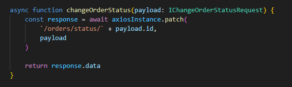
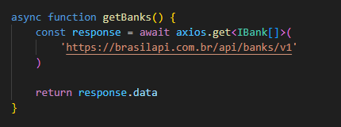

# Processamento Assíncrono

Sempre que for necessário aguardar um processamento assíncrono, cujo tempo de execução não pode ser controlado pelo aplicativo, devem ser usadas as **keywords** **async** e **await**, de forma a garantir que o aplicativo não trave o *loop de eventos* do *engine javascript* (o que poderia produzir a experiência de travamento no navegador, para o usuário, no caso de frontend), independente se o app roda em um navegador, no node.js ou em um dispositivo *mobile*. 

 

Exemplos deste tipo de situação, em um frontend, são:
- Acesso ao backend
- Acesso a uma API externa, por exemplo, Google ou AWS Storage.
- Acesso direto a um Banco de Daos, via nbiblioteca SDK ou via uma API 

 
 

Vamos fornecer alguns exemplos de como fazer isso.  

- Acesso ao backend: 

 

Neste caso, a *keyword* **await** precisa ser usada antes da função **axiosInstance.patch(...)**, para garantir que a função só retorna quando os dados em **response.data** estiverem prontos. 
Enquanto isso não ocorre, o *engine* JavaScript passa o controle do fluxo para o **loop de eventos** que irá determinar que outras *threads* do aplicativo ou de outros sistemas, devem ser executados, impedindo assim, que o seu navegador trave.

 
 

- Acesso a uma API externa: 

 
Similar ao exemplo anterior. 
 

 
 

***
