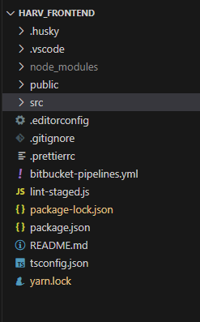
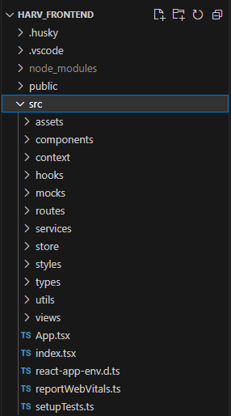

# Roteamento de páginas do Aplicativo

Todos os projetos devem procurar seguir a estrutura de folders descrita a seguir.

Na pasta principal do projeto, cujo nome é o nome do projeto, ou uma abreviação deste nome, tem-se o seguinte conteúdo:

TODO: Apresentar aqui uma descrição geral do conteúdo de cada sub-folder e de cada arquivo, neste nível.
 

***

## Pasta /src

A pasta '/src' deve ter os seguintes arquivos e sub-folders:

 

***

### Arquivo **index.tsx**

 

Este arquivo é gerado automaticamente pelo script *create-react-app*, é padrão em todos os frontends e, basicamente, é usado para vincular o componente React raiz do aplicativo ao elemento HTML que apresenta o conteúdo da página de entrada do aplicativo.

Como padrão, sempre chamamos o componente React raiz de 'App' e o elemento HTML que apresenta o conteúdo da página index.html de 'root', como se observa na figura acima.

Além disso, o arquivo 'index.html', é sempre criado na pasta '/public' pelo script *create-react-app*.

 

***

### Arquivo **App.tsx**

 

Este arquivo declara o componente raiz do aplicativo, sempre chamado de 'App'.

O 'coração' deste componente está no **return** de renderização, onde o componente que controla a renderização de todas as páginas e sub-componentes, chamado por padrão de 'Router', é envolto (*wrapped*) por vários contextos React que serão disponibilizados a todos os componentes do aplicativo.

**SoundProvider** é um componente provedor de contexto, desenvolvido pela BuildBox no arquivo 'src/context/SoundProvider.tsx', que utiliza a biblioteca [**use-sound**](https://github.com/joshwcomeau/use-sound#readme), e basicamente provê um *hook* capaz de reproduzir arquivos **.mp3**.

**Provider** é o componente da biblioteca [**redux**](https://react-redux.js.org/) que permite o armazenamento de informações, tais como informações do cliente ou transação, etc., de forma estruturada na máquina cliente.

**PersistGate** é o componente, da biblioteca [**redux-persist**](https://github.com/rt2zz/redux-persist) que permite a persistência dos dados salvos no *store* redux.

**ThemeProvider** é um componente, da biblioteca [**styled-components**](https://styled-components.com/), que permite definir um tema default para os aplicativos.

**MuiThemeProvider** é um segundo componente provedor de tema, que permite addicionar mais informações default ao tema default nos aplicativos, neste caso usando os recursos da biblioteca [**MUI**](https://mui.com/).

**QueryClient** e **QueryClientProvider** são componentes, da biblioteca [**react-query](https://tanstack.com/query/latest), que padronizam e facilitam a codificação da comunicação com API externas.

Além dos contextos acima, temos:

- Um styled-component, chamado **GlobalStyle**, mantido no arquivo 'src/styles/GlobalStyle.ts', que define o .css geral default de todas as páginas.

- Um componente chamado **ToastContainer**, parte da biblioteca [**react-toastify](https://fkhadra.github.io/react-toastify), usado para exibição de mensagens para o usuário.

 

***

### Pasta **assets**

 

Esta pasta contém todos os ícones, imagens, áudios, etc. estáticos a serem exibidos nas diversas telas e componentes do sistema.

 

***

### Pasta **assets**

 

