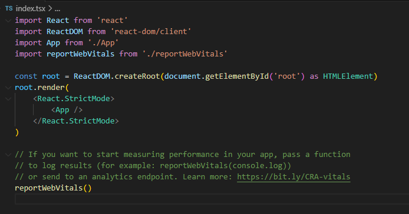

# Roteamento de páginas do Aplicativo

O controle de navegação entre as páginas se inicia no elemento HTML raiz do aplicativo, inicializado no arquivo **index.tsx**, conforme explicado na página que apresenta a estrutura de pastas, aqui [Estrutura de Pastas do Projeto](folder-structure.md).

Após as inicializações necessárias, a renderização do elemento raiz (método **render(...)** abaixo) passa o controle do fluxo do aplicativo para o componente raiz do aplicativo, chamado **App**.

A seguir, descrevemos o componente **App**.

 

***

### Componente **App**

 

Este componente é declarado no arquivo **App.tsx**, sendo o componente raiz do aplicativo, que deve ser, sempre, chamado de 'App'.

O 'coração' deste componente está no **return** de renderização, onde o componente que controla a renderização de todas as páginas e sub-componentes, chamado por padrão de 'Router', é envolto (*wrapped*) por vários contextos React que serão disponibilizados a todos os componentes do aplicativo.

**SoundProvider** é um componente provedor de contexto, desenvolvido pela BuildBox no arquivo 'src/context/SoundProvider.tsx', que utiliza a biblioteca [**use-sound**](https://github.com/joshwcomeau/use-sound#readme), e basicamente provê um *hook* capaz de reproduzir arquivos **.mp3**.

**Provider** é o componente da biblioteca [**redux**](https://react-redux.js.org/) que permite o armazenamento de informações, tais como informações do cliente ou transação, etc., de forma estruturada na máquina cliente.

**PersistGate** é o componente, da biblioteca [**redux-persist**](https://github.com/rt2zz/redux-persist) que permite a persistência dos dados salvos no *store* redux.

**ThemeProvider** é um componente, da biblioteca [**styled-components**](https://styled-components.com/), que permite definir um tema default para os aplicativos.

**MuiThemeProvider** é um segundo componente provedor de tema, que permite addicionar mais informações default ao tema default nos aplicativos, neste caso usando os recursos da biblioteca [**MUI**](https://mui.com/).

**QueryClient** e **QueryClientProvider** são componentes, da biblioteca [**react-query**](https://tanstack.com/query/latest), que padronizam e facilitam a codificação da comunicação com API externas.

Além dos contextos acima, temos:

- Um styled-component, chamado **GlobalStyle**, mantido no arquivo 'src/styles/GlobalStyle.ts', que define o .css geral default de todas as páginas.

- Um componente chamado **ToastContainer**, parte da biblioteca [**react-toastify**](https://fkhadra.github.io/react-toastify), usado para exibição de mensagens para o usuário.

 
 

***

### Componente **Routes**

 

O código deste componente está na pasta **/src/outes**, sendo o componente onde são declaradas todas as páginas e rotas do aplicativo.

